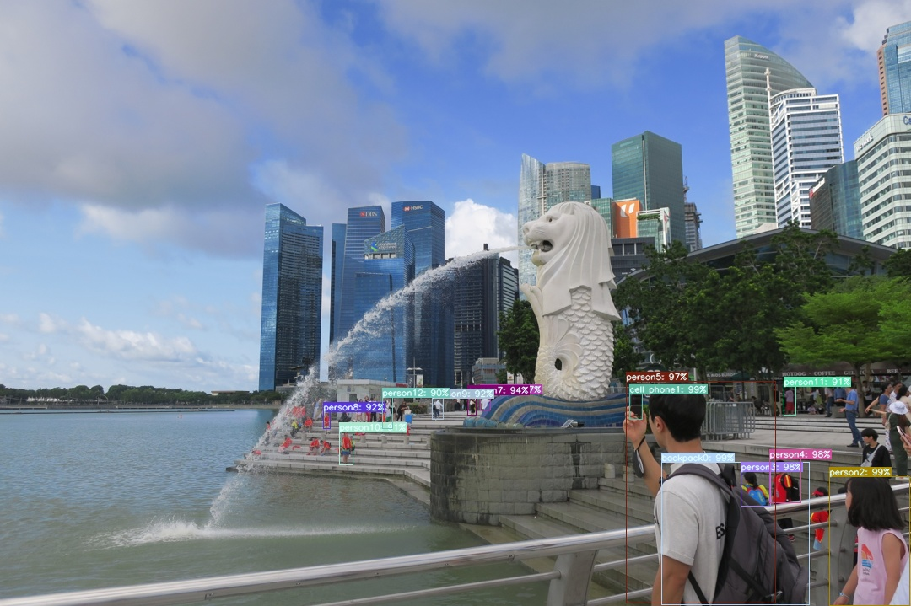

# 😎 物体検知API 😎

AWS lambdaに物体検知APIをコンテナデプロイするためのコード一式。本APIをAWS lambdaにデプロイすることで、以下のような物体検知結果が得られる。\
[Mask R-CNN論文](https://arxiv.org/abs/1703.06870) の ResNet-50-FPN バックボーンを備えた Mask R-CNN モデルを使用。

**物体検知結果例**\
</img>
```shell
{'backpack0': 99, 'cell phone1': 99, 'person10': 91, 'person11': 91, 'person12': 90, 
'person2': 99, 'person3': 98, 'person4': 98, 'person5': 97, 'person6': 97, 'person7': 94, 
'person8': 92, 'person9': 92}
```
**（参考書籍）**\
**<font size="3">Python FlaskによるWebアプリ開発入門 - 物体検知アプリ&機械学習APIの作り方 -</font>**\
佐藤 昌基、平田 哲也[著] 寺田 学[監修] 翔泳社

## 準備

1. 使用しているコンピューティング環境にpython、git、docker、AWS CLIをインストール。\
各ツールのインストール方法は各ツールのwebページを参照。

2. 下記コマンドで、本リポジトリをclone → cloneしたフォルダへ移動。
```shell
$ git clone https://github.com/berry921-public/detector-app-api.git
$ cd detector-app-api
```
3. python仮想環境をvenvで作成。
```shell
$ python -m venv .venv    # 作成する仮想環境名(.venv)は任意
```
4. 作成した仮想環境をアクティベートしてtorch、torchvisionをインストール。
```shell
$ . .venv\bin\activate
$ pip install torch==1.13.1+cpu torchvision==0.14.1+cpu --extra-index-url https://download.pytorch.org/whl/cpu
```
5. 下記コマンドで、学習済み物体検知モデル model.pt をダウンロード。
```shell
$ python download_model.py
```
6. AWS S3に detector-app-api-tmp という名称のバケットを作成。\
（本APIでは、物体検知後に作成された画像ファイルをS3に保存するため、予め作成しておく。）

## AWS lambdaへのコンテナデプロイ
1. AWS ECRにリポジトリを作成。\
（以降、 detector-app-api という名称のリポジトリを作成したものとして説明。）

2. 下記dockerコマンドで、コンテナイメージをビルド。
```shell
$ docker build --platform linux/amd64 -t detector-app-api .
```
3. 下記dockerコマンドで、AWS ECRにプッシュできるようタグ付け。
```shell
$ docker tag detector-app-api <your_aws_account_id>.dkr.ecr.<your_aws_region>.amazonaws.com/detector-app-api:latest
```
4. 下記AWS CLIコマンドで、AWSアカウントへのログインプロファイルを設定。
```shell
$ aws configure sso
SSO session name (Recommended): my-sso
SSO start URL [None]: <your_aws_access_portal_url>
SSO region [None]: <your_aws_region>
SSO registration scopes [None]: sso:account:access

CLI default client Region [None]: <your_aws_region>
CLI default output format [None]: json
CLI profile name [123456789011_ReadOnly]: my-dev-profile # ここで作成するprofile nameは任意。但し、次のステップの--profile引数も併せて変更すること。
```
5. 下記awsコマンドを実行し、AWS ECRにログイン。
```shell
$ aws ecr get-login-password --profile my-dev-profile | docker login --username AWS --password-stdin <your_aws_account_id>.dkr.ecr.<your_aws_region>.amazonaws.com
```
6. 下記dockerコマンドで、コンテナイメージをAWS ECRへプッシュ。
```shell
$ docker push <your_aws_account_id>.dkr.ecr.<your_aws_region>.amazonaws.com/detector-app-api:latest
```
7. AWS lambdaで、AWS ECRへプッシュしたコンテナイメージからlambda関数を作成。

8. メモリを3008MBに設定し、関数URLを作成。関数URLの認証タイプは None としておく。

9. 作成したlambda関数に、先に作成したAWS S3バケットへのアクセス権限を付与する。具体的には、AWS IAMで下記JSONで表されるポリシーを作成し、lambda関数のIAMロールにアタッチする。
```json
{
    "Version": "2012-10-17",
    "Statement": [
        {
            "Sid": "AllowDetectorAppApiToAccessS3",
            "Effect": "Allow",
            "Action": [
                "s3:GetObject",
                "s3:PutObject"
            ],
            "Resource": [
                "arn:aws:s3:::detector-app-api-tmp/*"
            ]
        }
    ]
}
```

## AWS lambdaへコンテナデプロイした後の使用方法

1. 下記コマンドで、物体検知APIが実行され検知結果が返ってくる。
```shell
python send_image.py <{your_aws_lambda_function_url}/detect> <path_to_your_image_file> --scale <scale>
# scale引数は基本的に指定不要（指定しなければ、デフォルト設定(1080)で実行される）。
# 1080より大きくするほど物体検知時の画像サイズが大きくなり、検知精度は上がるが、lambdaのメモリ上限(3008MB)を超えてエラーとなる可能性が高まるため非推奨。
# デフォルト値(1080)のままでもエラーとなることがあるため、その場合はscaleを適宜小さくする。
```
2. 下記コマンドで、物体検知結果を反映した画像ファイルがダウンロードされる。
```shell
python download_image.py <{your_aws_lambda_function_url}/download> <path_to_download_image_file>
```