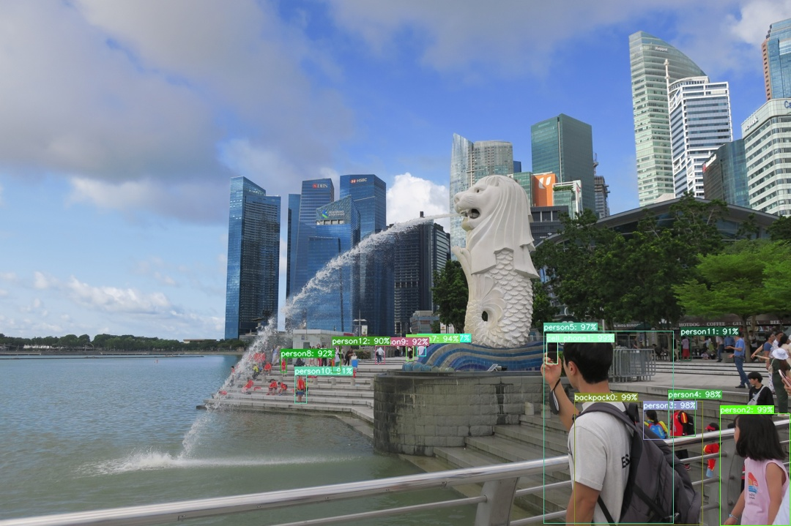

# 😎物体検知API😎

AWS lambda上に物体検知APIをコンテナデプロイするためのコード一式。\
本APIにより、以下のような物体検知結果を得ることができる。

</img>
```shell
{'backpack0': 99, 'cell phone1': 99, 'person10': 91, 'person11': 91, 'person12': 90, 'person2': 99, 'person3': 98, 'person4': 98, 'person5': 97, 'person6': 97, 'person7': 94, 'person8': 92, 'person9': 92}
```
**（参考図書）**\
Python FlaskによるWebアプリ開発入門 - 物体検知アプリ&機械学習APIの作り方 -\
佐藤 昌基、平田 哲也[著] 寺田 学[監修] 翔泳社

## 準備

1. 使用している環境にpython、git、docker、AWS CLIをインストール。\
→ 各ツールのインストール方法は各ツールのwebページを参照。

2. 下記コマンドを実行し、リポジトリをclone。
```shell
$ git clone git@github.com:berry921/detector-app-api.git
```
3. cloneしたフォルダへ移動。
```shell
$ cd detector-app-api
```
4. venvで仮想環境を作成。
```shell
$ python -m venv .venv    # 作成する仮想環境名(.venv)は任意
```
5. 作成した仮想環境をアクティベートしてtorch、torchvisionをインストール。
```shell
$ . .venv\bin\activate
$ pip install torch==1.13.1+cpu torchvision==0.14.1+cpu --extra-index-url https://download.pytorch.org/whl/cpu
```
6. 下記pythonコード download_model.py を作成。
```python:download_model.py
import torch
import torchvision
model = torchvision.models.detection.maskrcnn_resnet50_fpn(pretrained=True)
torch.save(model, "model.pt")
```
7. 下記コマンドを実行し、物体検知モデル model.pt をダウンロード。
```shell
$ python download_model.py
```
8. AWS S3に detector-app-api-tmp という名前のバケットを作成。\
→ 本APIでは、物体検知後に作成された画像ファイルをS3に保存するため、予め作成しておく。

## AWS lambdaへのコンテナデプロイ
1. AWS ECRにリポジトリを作成。\
→ 以降、 detector-app-api という名称のリポジトリを作成したものとして説明。

2. 下記dockerコマンドを実行し、コンテナイメージをビルド。
```shell
$ docker build --platform linux/amd64 -t detector-app-api .
```
3. 下記dockerコマンドを実行し、AWS ECRにプッシュできるようタグ付け。
```shell
$ docker tag detector-app-api <your_aws_account_id>.dkr.ecr.<your_aws_region>.amazonaws.com/detector-app-api:latest
```
4. 下記AWS CLIコマンドを実行し、AWSアカウントへのログインプロファイルを設定。
```shell
$ aws configure sso
SSO session name (Recommended): my-sso
SSO start URL [None]: <your_aws_access_portal_url>
SSO region [None]: <your_aws_region>
SSO registration scopes [None]: sso:account:access

CLI default client Region [None]: <your_aws_region>
CLI default output format [None]: json
CLI profile name [123456789011_ReadOnly]: my-dev-profile # ここで作成するprofile nameは任意。但し、次のステップの--profile引数も併せて変更すること。
```
5. 下記awsコマンドを実行し、AWS ECRにログイン。
```shell
$ aws ecr get-login-password --profile my-dev-profile | docker login --username AWS --password-stdin <your_aws_account_id>.dkr.ecr.<your_aws_region>.amazonaws.com
```
6. 下記dockerコマンドを実行し、コンテナイメージをAWS ECRへプッシュ。
```shell
$ docker push <your_aws_account_id>.dkr.ecr.<your_aws_region>.amazonaws.com/detector-app-api:latest
```
7. AWS lambdaで、AWS ECRへプッシュしたコンテナイメージからlambda関数を作成。

8. メモリを3008MBに設定し、関数URLを作成。関数URLの認証タイプは None としておく。

9. 作成したlambda関数に、AWS S3へのアクセス権限を付与する。具体的には、下記JSONで表されるポリシーをAWS IAMで作成し、lambda関数のIAMロールにアタッチする。
```json
{
    "Version": "2012-10-17",
    "Statement": [
        {
            "Sid": "AllowDetectorAppApiToAccessS3",
            "Effect": "Allow",
            "Action": [
                "s3:GetObject",
                "s3:PutObject"
            ],
            "Resource": [
                "arn:aws:s3:::detector-app-api-tmp/*"
            ]
        }
    ]
}
```

## AWS lambdaへコンテナデプロイした後の使用方法

1. 下記pythonコードを send_image.py という名前で保存。
```python:send_image.py
import sys
import urllib.parse
import urllib.request
import json

def send_image(url, image):
    # read image data
    with open(image, "rb") as f:
        reqbody = f.read()
    f.close()

    # create request with urllib
    req = urllib.request.Request(
        url=url,
        data=reqbody,
        method="POST",
        headers={"Content-Type": "application/octet-stream"}
    )
    with urllib.request.urlopen(req) as res:
        print(json.loads(res.read()))


if __name__ == "__main__":
    url, image = sys.argv[1], sys.argv[2]
    send_image(url, image)
```
2. 下記コマンドを実行すると物体検知APIが実行され、検知結果が返ってくる。
```shell
$ python send_image.py <your_aws_lambda_function_url> <path_to_your_image_file>
```
3. 下記pythonコードを download_image.py という名前で保存。
```python:download_image.py
import sys
import urllib.parse
import urllib.request

def download_image(url, result_file_path):
    with urllib.request.urlopen(url) as web_file:
        with open(result_file_path, "wb") as local_file:
            local_file.write(web_file.read())


if __name__ == "__main__":
    url, result_file_path = sys.argv[1], sys.argv[2]
    download_image(url, result_file_path)
```
4. 下記コマンドを実行すると物体検知した結果を反映した画像ファイルをダウンロードできる。
```shell
$ python download_image.py <your_aws_lambda_function_url> <path_to_download_image_file>
```